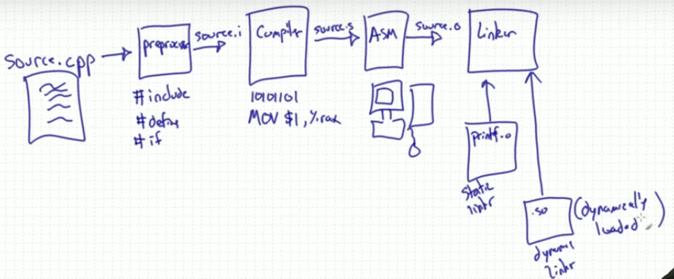

## C and C++ compilation process

Credit: [Mike Shah](https://youtu.be/ksJ9bdSX5Yo)



First thing is that there is source file of c++ called source.cpp. Then 
    
- It is passed through a preprocessor. It takes care of prepocessor directives such as `#include`, `#define`, `#if`, `#else`, etc. It finds all libraries that are included and get it ready for next stage. 
Preprocessor directive always begins with pound symbol **#**.

- In this stage compiler converts the source code to intermediate format, which may be assembly code or directly to machine code. 
- Now, assembler converts the code to target architecture and outputs **source.o** file.
- Linker joins the object code of library functions to object code of source file.

### Compiler Flags

1. -I (include directory for locating libraries which cannot be located automatically)
2. -L (Library directory for specifying exact location of library)
3. -l (dynamically linked libraries files)

**Source files**

- main.cpp
- source.cpp
- source.hpp

```cpp
//main.cpp
#include "source.hpp"

int main(){
    return 0;
}
```

```cpp
//source.cpp
int add(int a, int b){
    return a+b;
}
```

```cpp
//source.hpp
int add(int a, int b);

```
If we run
```bash
g++ main.cpp
ls
```
Output is 
```
a.out main.cpp source.cpp source.hpp
```
Here a.out is exectuable we get. Suppose we want to output `prog` as executable. Then, we do
```bash
g++ main.cpp -o prog
```

If we want to see what preprocessor sees then we run
```bash
g++ -E main.cpp
```
Output is 
```
# 0 "main.cpp"
# 0 "<built-in>"
# 0 "<command-line>"
# 1 "/usr/include/stdc-predef.h" 1 3 4
# 0 "<command-line>" 2
# 1 "main.cpp"
# 1 "source.hpp" 1
int add(int a, int b);
# 2 "main.cpp" 2

int main(){
    return 0;
}
```

If we `add(2,3)` inside main.cpp, then compiler throws an error saying `undefined reference to 'add(int,int)'` , although it exists and preprocessor sees it. 

If want to promise that function exist and implementation of that function is included then we prefix every functions prototype with `extern` in **source.hpp**. 
```cpp
// source.hpp
extern int add(int a, int b);
```
Most of the time this can be excluded. This fact is implicit.

`undefined reference to 'add(int,int)'` can be fixed by explicitly adding implementation file during compiling. For example
```bash
g++ main.cpp source.cpp -o prog
```

In large projects, there is a danger of including files or implementaion multiple times which can be cause of bugs. In order to avoid that there is **header guard**. For example we can check if particular header is included, if not we can include it. For example

```cpp
//source.hpp
#ifndef SOURCE_HPP
#define SOURCE_HPP
extern int add(int a, int b);
#endif

```
This will include the source file only once. Even if this file is included multiple times, explicitly or otherwise.


In compilation stage, it basically builds trees of some form, which may be *abstract syntax tree* or *concrete syntax tree* , which makes it easier to manipulate expressions and detect errors in the syntax. Apart from it code generation also takes place in *assembly* (basically machine code in textual representation)

If we want to look at tree built from program, we can run for example

```bash
g++ -fdump-tree-all-graph -g main.cpp source.cpp 
```
Here `-g` is used to compile in debugging mode. We can view the graph which have *.dot* extension run `dot -Tsvg filename.dot > filename.svg && xdg-open filename.svg`

If we want look at assembly we can do
```bash
g++ -S main.cpp
```
It generates *main.s* file.

In linking stage, it takes various *.o* object files and compiles it into one .
We can manually get object file for single file which may or may not depend on other program files.
```bash
g++ -c main.cpp
g++ -c source.cpp
```
These will output *main.o* and *source.o* files.
We can link them into a executable *prog* as
```bash
g++ main.o source.o -o prog
```

Generally, one cannot read *.o* but we can use `objdump` tool to examine in much more human friendly format. For example
```bash
objdump -t main.o
```
Note also that some libraries are dynamically linked as opposed to statically linked meaning that those are joined at the runtime. These files end in *.so* (in Linux), *.dll* (in Windows) and *.dylib* (in MacOS). 

We can check which shared libraries are loaded at runtime by running
```bash
ldd ./prog
```
We might wonder how does the compiler know where to look for those *.so* (dynamic libraries which are loaded at runtime). Actually location for those libraries are stored in special **PATH** variable of linux (analgous environment variable exist in Windows). It stores many addresses separated by colon **:** .